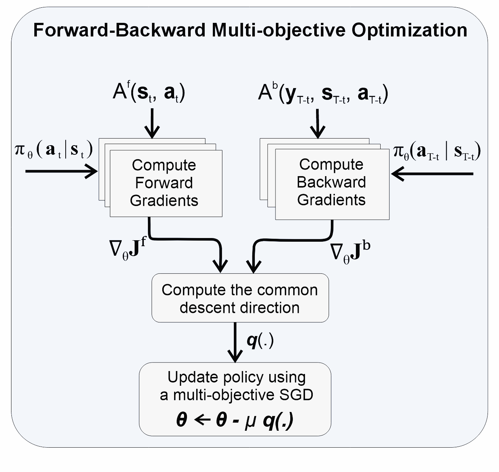
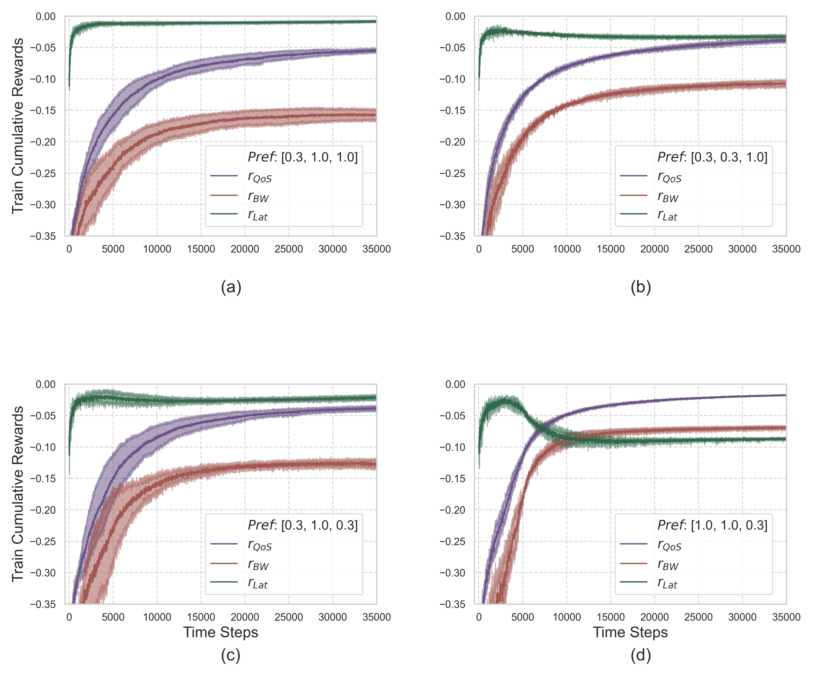
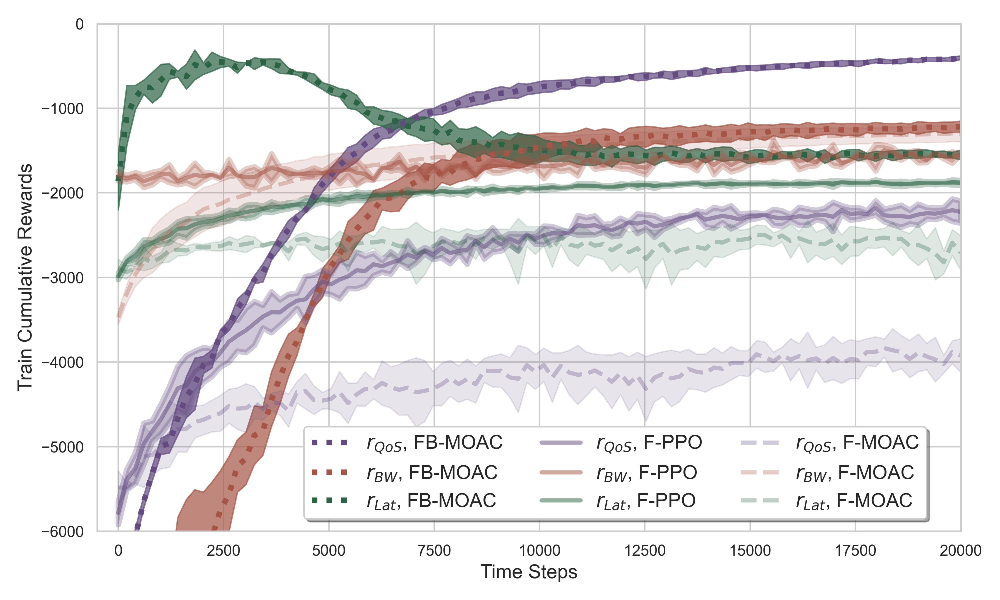
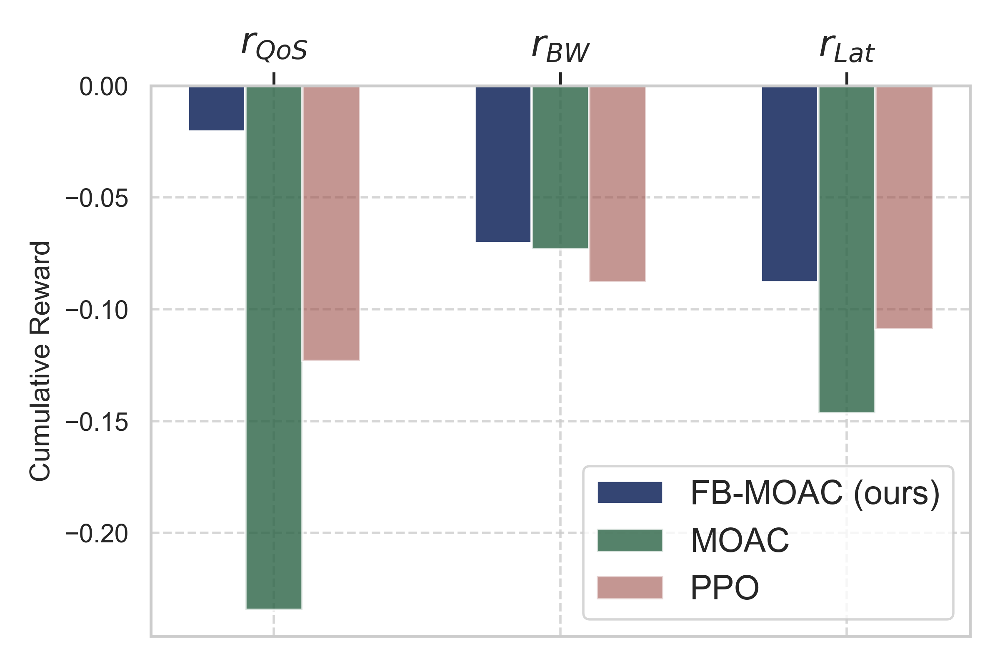
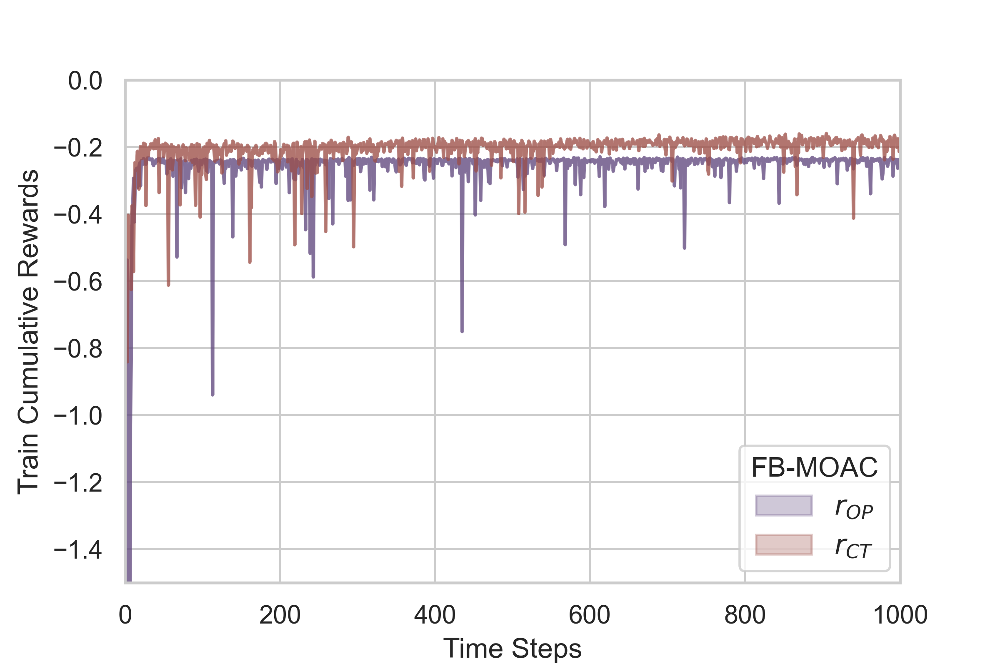
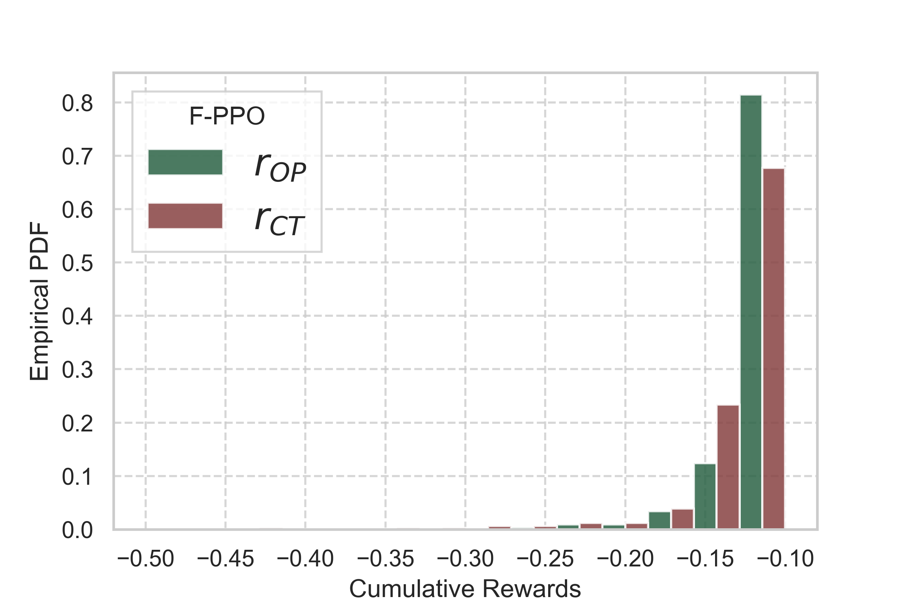
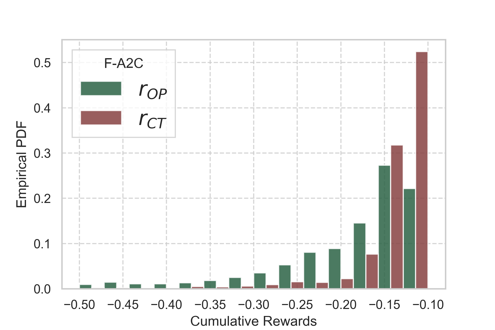

# 🚀 FB‑MOAC: Forward–Backward Multi‑Objective Actor‑Critic


## 📑  Introduction

**FB‑MOAC** (Forward–Backward Multi‑Objective Actor‑Critic) is a PyTorch implementation for solving **multi‑objective** sequential decision problems 
modeled as **Forward–Backward MDPs (FB‑MDPs)**—see the illustration below.
It also supports standard MDPs with minimal tuning of hyperparameters.

|  An examplery illustration of a FB-MDP.  |
| :-------------------------:|
|  |

The diagram of FB-MOAC algorithm is shown below.
|  Diagram of FB-MOAC algorithm |  Forward-Backward Multi-Objective Optimization of FB-MOAC  |
| :-------------------------:| :-------------------------:|
|    |   |
| The FB-MOAC algorithm consists **forward evaluation**, **backward evaluation** and **bidirectional learning** steps. During the first two steps, the forward and backward dynamics are evaluated, using forward/backward critics, and the resulting experiences are buffered. By a proper chronological order, the policy distribution is optimized in the bidirectional learning step based on the experiences of both forward and backward dynamics and using a **forward-backward multi-objective learning**. The algorithm is additionally equipped with an add-on **episodic MCS-average** to boost the convergence to Pareto-optimal solutions. | This step first computes the vector-valued gradients of forward and backward objectives, then compute the descent direction q(\.) to ensure that all rewards increase simultaneously,  and finally update the parameters of actor network based on q(.).|


## 🧪 Usage
- To train the RL agent on a FB-MDP: run `train.py`
- To test a preTrained network : run `test.py`

  ### Experiments:
  Notice that current (standard) RL baselines/experiments are not applicable to forward-backward MDPs. Hence, we go beyond them to assess our algorithm on real-world problems characterized by FB-MDPs.
  For this, we have provided two large-scale experiments falling within FB-MDP frameworks.
  The first experiment is a edge-cashing problem in the context of communication networkings,
  and the second experiment is a computation offloading problem in the domain of cloud computing systems. 
  These experiments are provided in the folder [*experiment*]. Moreover, there is a [Readme] in that folder that explains these experiments and thier hyper-parameters.

  For the edge caching experiment, please uncomment the syntax **from environments.EdgeCaching import NetEnv** and for the computation odffloading experiment uncomment the syntax **from environments.ComputationOffloading import NetEnv**
  in the train.py or test.py.

### ⚙️ Algorithm hyperparameters:
-    **Print_freq**        :                        The frequency based on which the training results should be printed. (after how many episodes).
 -   **Save_model_freq**    :                       The frequencyt based on which  the parameters of model should be saved.
  -  **AverageFrequency**   :                       The frequency based on which  the cumulative rewards should be averagd for the printing and logging purposes.
  -  **N_MCS**             :                        Number of Monte-Carlo Samples for the *episodic MCS-average* add-on.
   - **EpisodeNumber**   :                          Number of training episodes.
  -  **TimeSlots**         :                        Number of time-steps in each episode.
   - **LearningRate**    :                          Learning-Rate of the FB-MOAC algorithm, for *multi-objective actor* and *forward/backward critics*.
   - **SmoothingFactor** :                          The smoothing factor of the episodic MCS-average  add-on.
  -  **DiscountFactor**   :                         Discount-factor related to the cumulative rewards.
  -  **PreferenceCoeff**                            Preference parameter, for forward and backward rewards, to extract a Pareto-front. (e.g. for a problem with 2 forward rewards and one backward one, one may set PreferenceCoeff = torch.tensor([p1, p2, p3]) which means that forward rewards have p1 and p2 preferences and backward reward has p3. )

##### Note :
  - For each environment, the hyper-parameters need fine-tuning. FB-MOAC can also be used for forward-only multi-objective MDP problems.


## 📈  Results
### (1) Edge-Cahing  Experiment.
please refer to the Readme file inthe environment folder to see a brief explanation for this experiment. 
Full details are given in the paper. 

|Obtained Pareto-set of FB-MOAC for edge-caching experiment |
|:-------------------------:|
|   | 


| Training Comparison of FB-MOAC against PPO and MOAC (a multi-objective A2C) | Comparison of Final Solutions of FB-MOAC against PPO and MOAC (a multi-objective A2C) | 
| :-------------------------:|:-------------------------:|
|   |   | 


### (2) Computation-Offloading  Experiment
please refer to the Readme file inthe environment folder to see a brief explanation for this experiment. 
Full details are given in the paper. 


| Performance of solution of FB-MOAC for computation offloading experiment  | Histogram of solution of FB-MOAC for computation offloading experiment  |
| :-------------------------:|:-------------------------:|
|   |  |


| Comparison of solution of PPO for computation offloading experiment  | Comparison of solution of A2C for computation offloading experiment  |
| :-------------------------:|:-------------------------:|
|   |   | 


## 🛠️ Dependencies
Trained and Tested on:
```
Python 3.11
PyTorch
NumPy
scipy.special
```
Training Environments 
```
Edge-caching
Computation-offloading
```
Graphs
```
matplotlib
```

## 📚 Reference

This repository accompanies:
Mohsen Amidzade, Mario Di Francesco, "FB‑MOAC: Forward–Backward Multi‑Objective Actor‑Critic", TMLR, 2025.🔗 https://openreview.net/forum?id=li5DyC6rfS
